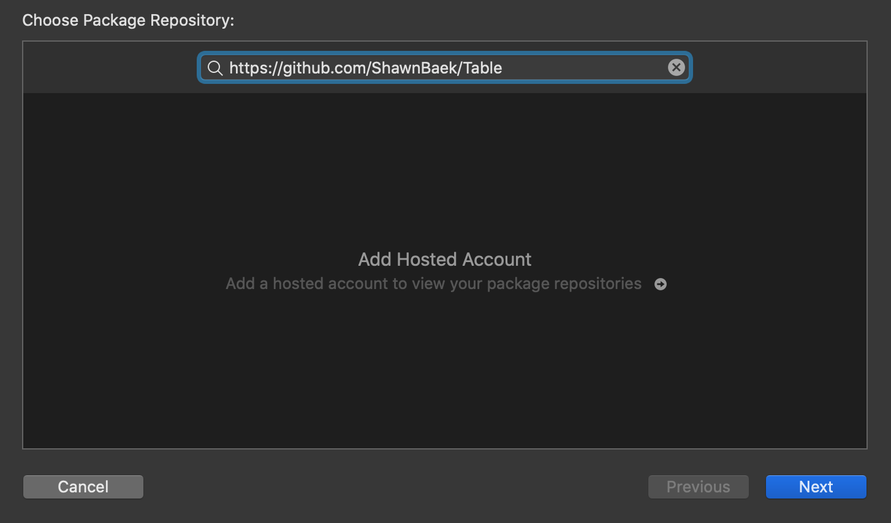
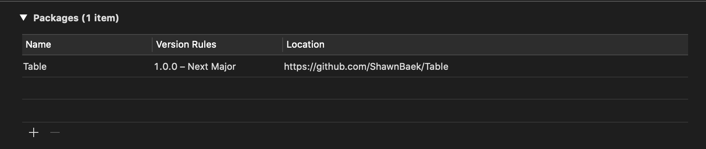
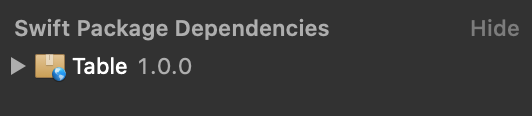

# Welcome to Table
The table is a helper function to print the table. You can print the table bypassing the Any data! 
[e.g., 1d array, 2d array, and dictionary]

It inspired by `javascript` `console.table`. 

I'm sure if you practice coding interviews, it helps you a lot. You don't need to struggle for checking results using a build-in print function!

## Usage

```swift
import Table
//1D Array of String with Header
print(table: ["Good", "Very Good", "Happy", "Cool!"], header: ["Wed", "Thu", "Fri", "Sat"])

//1D Array of Int
print(table: [2, 94231, 241245125125])

//1D Array of Double
print(table: [2.0, 931, 214.24124])

//2D Array of String
print(table: [["1", "HELLOW"], ["2", "WOLLEH"]], header: ["Index", "Words"])

//2D Array of String, but Length is not equal!
print(table: [["1", "b2"], ["Hellow", "Great!"], ["sdjfklsjdfklsadf", "dsf", "1"]])

//2D Array of Int, but Length is not equal!
print(table: [[1, 2, 3], [4, 5, 6], [7, 8, 9, 10]])

//D.I.C.T.I.O.N.A.R.Y!!
print(table: ["1": 1, 2: "Hellow?", 1.2: 0, "I'm Table": [1, 2, 3, 2, 1]], header: ["key", "value"])
```

```console
+----+---------+-----+-----+
|Wed |Thu      |Fri  |Sat  |
+----+---------+-----+-----+
|Good|Very Good|Happy|Cool!|
+----+---------+-----+-----+

+-+-----+------------+
|2|94231|241245125125|
+-+-----+------------+

+---+-----+---------+
|2.0|931.0|214.24124|
+---+-----+---------+

+-----+------+
|Index|Words |
+-----+------+
|1    |HELLOW|
+-----+------+
|2    |WOLLEH|
+-----+------+

+----------------+------+-+
|1               |b2    | |
+----------------+------+-+
|Hellow          |Great!| |
+----------------+------+-+
|sdjfklsjdfklsadf|dsf   |1|
+----------------+------+-+

+-+-+-+--+
|1|2|3|  |
+-+-+-+--+
|4|5|6|  |
+-+-+-+--+
|7|8|9|10|
+-+-+-+--+

+---------+---------------+
|key      |value          |
+---------+---------------+
|2        |Hellow?        |
+---------+---------------+
|I'm Table|[1, 2, 3, 2, 1]|
+---------+---------------+
|1.2      |0              |
+---------+---------------+
|1        |1              |
+---------+---------------+

```

## Support Distribution
The default distribution is `fillProportionally`.

```swift
print(table: ["Good", "Very Good", "Happy", "Cool!"], header: ["Wed", "Thu", "Fri", "Sat"])
```
```swift
+----+---------+-----+-----+
|Wed |Thu      |Fri  |Sat  |
+----+---------+-----+-----+
|Good|Very Good|Happy|Cool!|
+----+---------+-----+-----+
```

But It can be set by `fillEqually` like below

```swift
print(table: ["Good", "Very Good", "Happy", "Cool!"], header: ["Wed", "Thu", "Fri", "Sat"], distribution: .fillEqually)
```
```swift
+---------+---------+---------+---------+
|Wed      |Thu      |Fri      |Sat      |
+---------+---------+---------+---------+
|Good     |Very Good|Happy    |Cool!    |
+---------+---------+---------+---------+
```

## SPM Support

The table is only supported SPM (Swift Package Management)





## What's the next step?!
I'm going to support more types!
- tuple
- decodable / encodable
- custom data type
- emoticon / unicode

## Unit Tests
I'm going to add testCases next time.

## Contributing to Table
Contributions to the Table are welcomed and encouraged!

## Contact Me
If you have any questions about `Table`, please email me at shawn@shawnbaek.com

